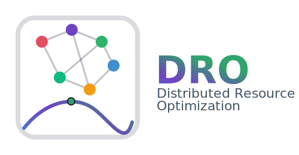

<p align="center">
  
</p>

<p align="center">
  <a href="https://github.com/Digitalized-Energy-Systems/mango-optimization/actions/workflows/test.yml">
    
  </a>
  <a href="https://codecov.io/gh/Digitalized-Energy-Systems/mango-optimization">
    
  </a>
  
  <a href="https://github.com/Digitalized-Energy-Systems/mango-optimization/blob/main/LICENSE">
    
  </a>
  <a href="https://pypi.org/project/distributed-resource-optimization/">
    
  </a>
</p>

# Distributed Resource Optimization

A Python package providing distributed optimization algorithms for coordinating flexible
resources. Algorithms are implemented independently of any particular communication
backend — a pluggable *carrier* abstraction lets you run the same algorithm code in a
single asyncio process or across a real network via [mango-agents](https://github.com/OFFIS-DAI/mango).

Three algorithm families are available:

| Algorithm | Problem type | Coordination |
|-----------|-------------|--------------|
| **ADMM Sharing** | Continuous resource allocation, sum-to-target | Coordinator required |
| **ADMM Consensus** | Agents converge to a shared target vector | Coordinator required |
| **COHDA** | Combinatorial schedule selection, weighted L1 target | Fully distributed |
| **Averaging Consensus** | Distributed averaging with optional gradient terms | Fully distributed |

Two carriers are included:

| Carrier | When to use |
|---------|-------------|
| **SimpleCarrier** | In-process asyncio simulation — zero overhead, ideal for prototyping and testing |
| **MangoCarrier** | Networked multi-agent deployments via mango-agents |

> **Note:** the package is still experimental. API may change between minor versions.

---

## Installation

```bash
pip install distributed-resource-optimization
```

For networked deployments with [mango-agents](https://github.com/OFFIS-DAI/mango):

```bash
pip install "distributed-resource-optimization[mango]"
```

For development:

```bash
git clone https://github.com/Digitalized-Energy-Systems/mango-optimization
cd mango-optimization
pip install -e ".[dev,docs]"
```

---

## Quick Start

### ADMM Sharing — flexible resource coordination

Three resources must collectively match a power target. The sharing ADMM distributes the
load optimally:

```python
import asyncio
from distributed_resource_optimization import (
    create_admm_flex_actor_one_to_many,
    create_sharing_target_distance_admm_coordinator,
    create_admm_sharing_data,
    create_admm_start,
    start_coordinated_optimization,
)

async def main():
    # Three resources: 10 kW, 15 kW, 10 kW input capacities
    # Efficiency vectors map input to three output types
    flex1 = create_admm_flex_actor_one_to_many(10, [0.1,  0.5, -1.0])
    flex2 = create_admm_flex_actor_one_to_many(15, [0.1,  0.5, -1.0])
    flex3 = create_admm_flex_actor_one_to_many(10, [-1.0, 0.0,  1.0])

    # Target combined output [-4, 0, 6] with first sector weighted x5
    coordinator = create_sharing_target_distance_admm_coordinator()
    start = create_admm_start(create_admm_sharing_data([-4, 0, 6], [5, 1, 1]))

    await start_coordinated_optimization([flex1, flex2, flex3], coordinator, start)

    print(flex1.x)  # optimal output for resource 1
    print(flex2.x)  # optimal output for resource 2
    print(flex3.x)  # optimal output for resource 3

asyncio.run(main())
```

### COHDA — combinatorial schedule coordination

Each participant selects exactly one schedule from a discrete set; COHDA minimises the
L1 distance of the aggregate to a target:

```python
import asyncio
from distributed_resource_optimization import (
    create_cohda_participant,
    create_cohda_start_message,
    start_distributed_optimization,
)

async def main():
    actor1 = create_cohda_participant(1, [[0.0, 1, 2], [1, 2, 3]])
    actor2 = create_cohda_participant(2, [[0.0, 1, 2], [1, 2, 3]])

    start = create_cohda_start_message([1.2, 2.0, 3.0])
    await start_distributed_optimization([actor1, actor2], start)

    print(actor1.memory.solution_candidate.schedules.sum(axis=0))

asyncio.run(main())
```

### Using SimpleCarrier directly

For full control over message flow, create the container and carriers yourself:

```python
import asyncio
from distributed_resource_optimization import (
    ActorContainer, SimpleCarrier, cid,
    create_cohda_participant, create_cohda_start_message,
)

async def main():
    container = ActorContainer()
    c1 = SimpleCarrier(container, create_cohda_participant(1, [[0.0, 1, 2], [1, 2, 3]]))
    c2 = SimpleCarrier(container, create_cohda_participant(2, [[0.0, 1, 2], [1, 2, 3]]))

    start = create_cohda_start_message([1.2, 2.0, 3.0])
    c1.send_to_other(start, cid(c2))
    await container.done_event.wait()

asyncio.run(main())
```

---

## Documentation

Full documentation including algorithm background, tutorials, and API reference is available at:

**https://digitalized-energy-systems.github.io/mango-optimization/**

---

## Contributing

Contributions are welcome. Please open an issue or pull request on
[GitHub](https://github.com/Digitalized-Energy-Systems/mango-optimization).

---

## License

[MIT](LICENSE)
